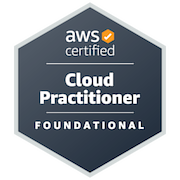
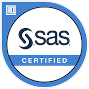

<h2 align="center">Hi there 👋</h2>

---

I'm Sanket Sahasrabudhe, a Graduate Student at the <a href="https://www.analytics.ncsu.edu">Institute for Advanced Analytics</a>, North Carolina State University.

  

If I had to describe myself in one line, I would say that I'm a versatile analyst with experience in data wrangling, automating data pipelines, and developing
machine learning models with emphasis on communicating results to stakeholders.
I have always enjoyed solving problems using Python and love learning about the recent advancements in the space of Machine Learning.

---

My primary skillset includes Python, SQL, R, and Tableau. I have completed multiple internships that focused on data science and software engineering during my time as an undergrad student in Mumbai, India. I worked at <a href='https://www.mygreatlearning.com'>Great Learning</a> as an Associate Data Scientist, where I built and maintained dashboards focused on learner attrition in the International Operations Department.

I have also passed 3 certifications in the past 6 months:
1. AWS Cloud Practitioner [Verification Link](https://www.credly.com/badges/46b1a055-b35f-4719-a3d8-043340660e95/public_url)

  

2. Dataiku Core Designer Certificate [Verification Link](https://verify.skilljar.com/c/qmsrved3r5xi)

  

3. SAS Base Programming Specialist Certification [Verification Link](https://www.credly.com/badges/db38c15b-21ca-4ce6-8671-2654e436a832/public_url)

  

---

🔭 Currently, I'm a part of a practicum project sponsored by Blue Cross Blue Shield, Minnesota. 

📫 Feel free to get in touch with me at [sssahas3@ncsu.edu](mailto:sssahas3@ncsu.edu?subject=GitHub%20Repo%20-%20Reaching%20Out)

😄 Pronouns: He/Him

<!--
**sss-xt1068/sss-xt1068** is a ✨ _special_ ✨ repository because its `README.md` (this file) appears on your GitHub profile.

Here are some ideas to get you started:

- 🔭 I’m currently working on ...
- 🌱 I’m currently learning ...
- 👯 I’m looking to collaborate on ...
- 🤔 I’m looking for help with ...
- 💬 Ask me about ...
- 📫 How to reach me: ...
- 😄 Pronouns: ...
- ⚡ Fun fact: ...
-->
